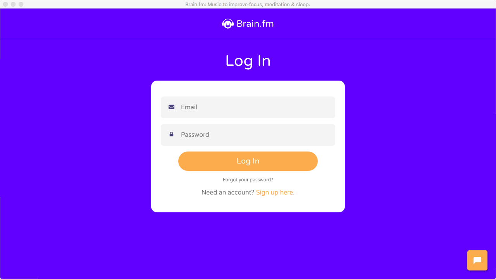

# Brain.fm-Desktop-Client
https://brain.fm Desktop client

Simple Electron app as a desktop client for Brain.fm

Runs in a standalone window with keyboard media button control for play/pause.

## Download

You can download the latest binaries for macOS, Windows, and Linux [here](https://github.com/Dinius/Brain.fm-Desktop-Client/releases/latest).

## Screenshots

